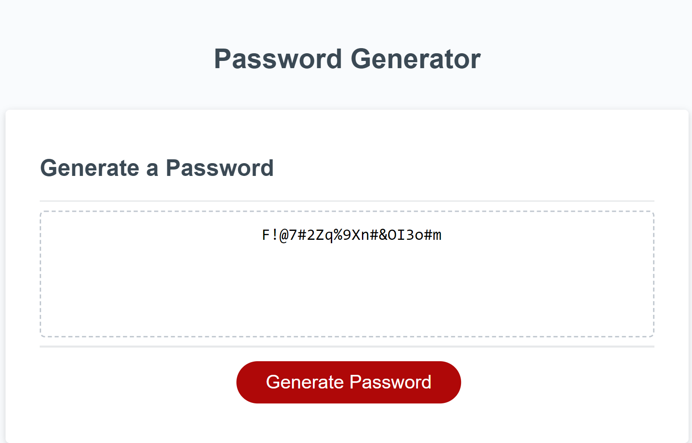

# Random Password Generator 
Structured JavaScript code to randomly generate a password based on criterias selected by a user.  

## Project Description
This web application consists of a HTML, CSS, and JavaScript file. The structure and styling of the page is set by the HTML
and CSS files. The purpose of these files is to provide the user with a simple and clear user interface to interact with. The
JavaScript file holds the functionality of the password generator. The password that is generated for the user is based
on a select set of criterias that the user can choose from. Below describes the functionality of the generator and the 
criterias that the user can select from:

* The javascript file selects the "Generate Password" button from the HTML file and starts the prompts for the user to 
select the password characteristics.
* Once the user selects the "Generate Password" button they are presented with the option to choose how many characters to use in their password.
* If the user inputs text, or a number that is lower than 8 or higher than 128 then the user is alerted their input is not
valid and prompted until the input is valid.
* If the user selects to Cancel the input then the program stops and displays in the web page that the user canceled password
generation.
* Once a valid entry is given, the user has the choice of using lowercase, uppercase, numeric and special characters.
* If the user doesnt select any options the password will default to using only lowercase letters.
* Once the choices are selected, the random password is displayed to the page.
 

## Snapshot of Deployed site
* Snapshot below shows the final result of the program being ran with the user input of 20 characters, and using all character
options:

## Project URLs
* Deployed site URL: 
* GitHub Repo URL: